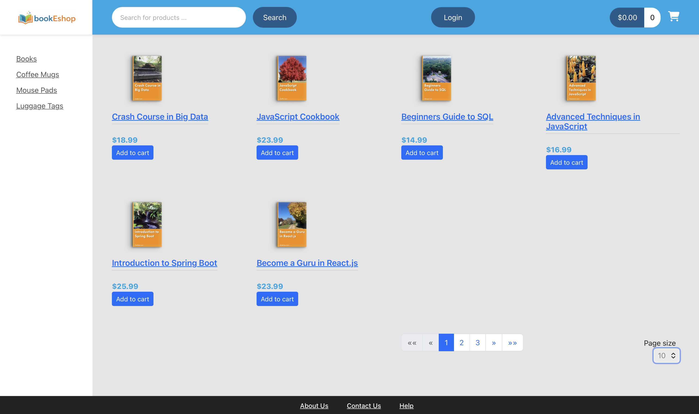
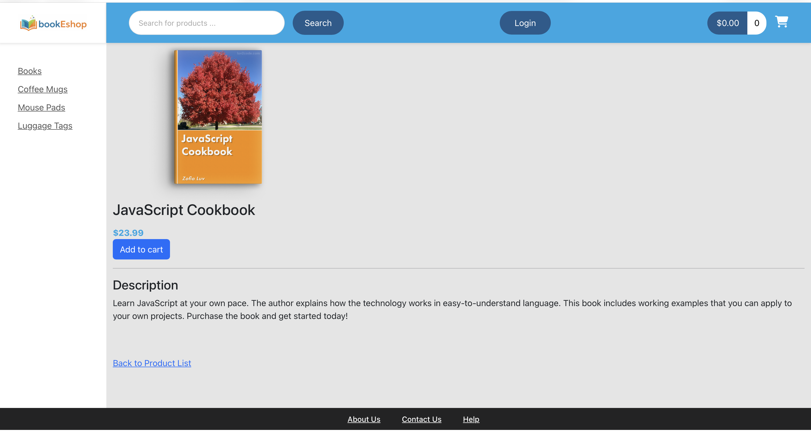
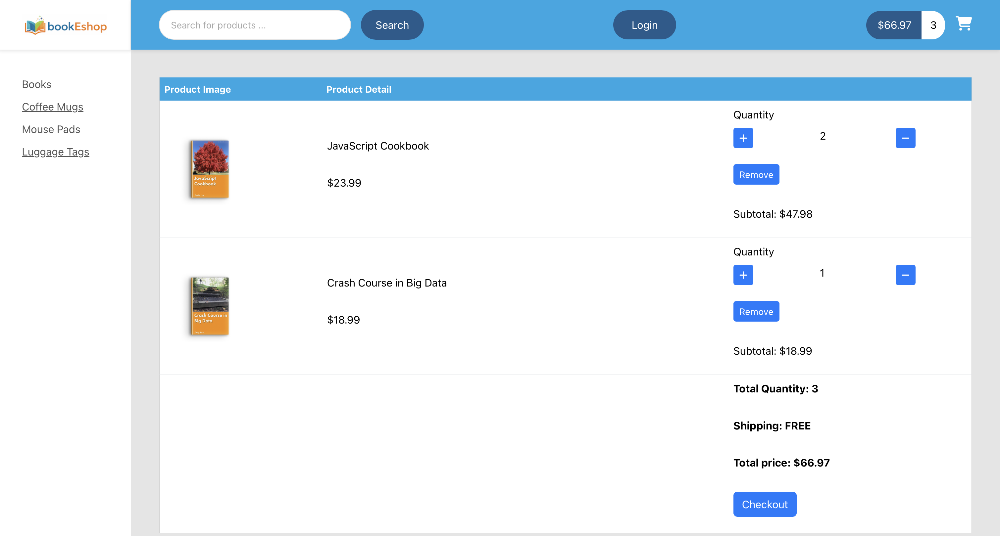
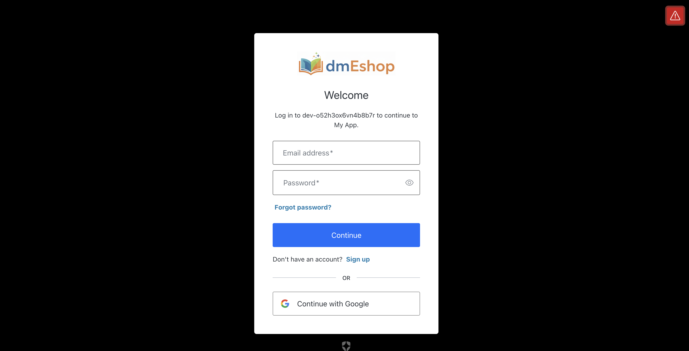

# 🛒 ecommerce-project

A production-style, full-stack e-commerce web application built with **Angular** (frontend) and **Java Spring Boot** (backend). The project covers the complete purchase flow — from browsing products to secure checkout with real credit card processing — and includes enterprise-grade authentication and authorization.

---

## 📸 Screenshots

| Product Catalog | Product Detail |
|---|---|
|  |  |

| Shopping Cart | Login / Auth0 |
|---|---|
|  |  |

---

## 🧰 Tech Stack

### Frontend
| Technology | Purpose |
|---|---|
| Angular 14.2.13 | SPA framework |
| TypeScript 4.7.4 | Strongly-typed JavaScript |
| HTML5 / CSS3 | Markup & styling |
| Angular Router | Client-side navigation |
| RxJS 7.5.7 | Reactive programming |
| HttpClient | REST API communication |

### Backend
| Technology | Purpose |
|---|---|
| Java 17+ | Core language |
| Spring Boot | Application framework |
| Spring Data JPA | ORM & database access |
| Spring Security | Authentication & authorization |
| MySQL | Relational database |
| Maven | Build & dependency management |

### Security & Payments
| Technology | Purpose |
|---|---|
| JWT (JSON Web Tokens) | Stateless authentication |
| Auth0 | Third-party auth |
| SSL / TLS | Encrypted communication (HTTPS) |
| Stripe API | Credit card payment processing |

---

## 🏗️ Architecture

```
┌─────────────────────────────────────┐
│            Angular Frontend          │
│  (TypeScript, Components, Services)  │
└────────────────┬────────────────────┘
                 │ REST API (JSON over HTTPS)
┌────────────────▼────────────────────┐
│         Spring Boot Backend          │
│  Controllers → Services → JPA Repos  │
└────────────────┬────────────────────┘
                 │
       ┌─────────┴─────────┐
       │                   │
┌──────▼──────┐    ┌───────▼──────┐
│   MySQL DB   │    │  Stripe API  │
└─────────────┘    └──────────────┘
```

**Key design patterns:**
- RESTful API design
- Service layer / Repository pattern (Spring)
- Component-driven architecture with reactive forms (Angular)
- Stateless JWT-based sessions

---

## ✨ Features

- **Product Catalog** — Browse and filter products with pagination
- **Shopping Cart** — Add, remove and update items in real time
- **Checkout Flow** — Multi-step checkout with order summary
- **Stripe Payments** — Secure credit card processing (card data never touches our server)
- **User Authentication** — Login / logout with JWT, Auth0 & OpenID Connect
- **Protected Routes** — Route guards on frontend, method-level security on backend
- **HTTPS / SSL** — Fully encrypted client-server communication

---

## 🔐 Security Overview

| Layer | Implementation |
|---|---|
| Authentication | JWT issued on login, validated on every request |
| Social Login | Auth0 |
| Transport | SSL/TLS — HTTPS end-to-end |
| Frontend | Angular route guards block unauthorized access |
| Backend | Spring Security with role-based method security |

---

## 💳 Payment Flow (Stripe)

1. User fills in the checkout form
2. Angular collects card details via **Stripe.js** — card data goes directly to Stripe, never to our server
3. Spring Boot backend creates a **Payment Intent** via the Stripe API
4. Stripe confirms the charge
5. Order is persisted to the database on success

---

## 📁 Project Structure

```
ecommerce-project/
├── 01-starter-files/
│   └── db-scripts/          # SQL scripts to set up the database schema & seed data
│
├── 02-backend/
│   └── spring-boot-ecommerce/
│       ├── src/main/java/
│       │   └── com/danmil/ecommerce/
│       │       ├── config/          # Security, CORS, Stripe config
│       │       ├── controller/      # REST controllers
│       │       ├── dto/             # Request/Response objects
│       │       ├── entity/          # JPA entities
│       │       ├── repository/      # Spring Data repositories
│       │       └── service/         # Business logic
│       └── pom.xml
│
├── 03-frontend/
│   └── angular-ecommerce/
│       └── src/app/
│           ├── components/          # UI components
│           ├── services/            # HTTP & state services
│           ├── guards/              # Route guards
│           └── models/              # TypeScript interfaces
│
└── 04-docs/
    └── screenshots/
```

---

## 🛠️ Getting Started

### Prerequisites

- **Java 17+** — [Download](https://adoptium.net/)
- **Node.js 16.10.0** — [Download](https://nodejs.org/)
- **Angular CLI 14.0.7** — `npm install -g @angular/cli@14.0.7`
- **MySQL** running locally or via Docker
- **Stripe account** — test mode keys work fine

### Backend

```bash
git clone https://github.com/danmil1996/ecommerce-project.git
cd ecommerce-project/02-backend/spring-boot-ecommerce

# Configure src/main/resources/application.properties
spring.datasource.url=jdbc:mysql://localhost:3306/ecommerce
spring.datasource.username=YOUR_DB_USER
spring.datasource.password=YOUR_DB_PASSWORD
stripe.key.secret=sk_test_YOUR_KEY

./mvnw spring-boot:run
# Runs on https://localhost:8443
```

### Frontend

```bash
cd ../../03-frontend/angular-ecommerce
npm install

# Configure src/environments/environment.ts
# shopApiUrl: 'https://localhost:8443/api'
# stripePublishableKey: 'pk_test_YOUR_KEY'

ng serve
# Runs on http://localhost:4200
```

---
